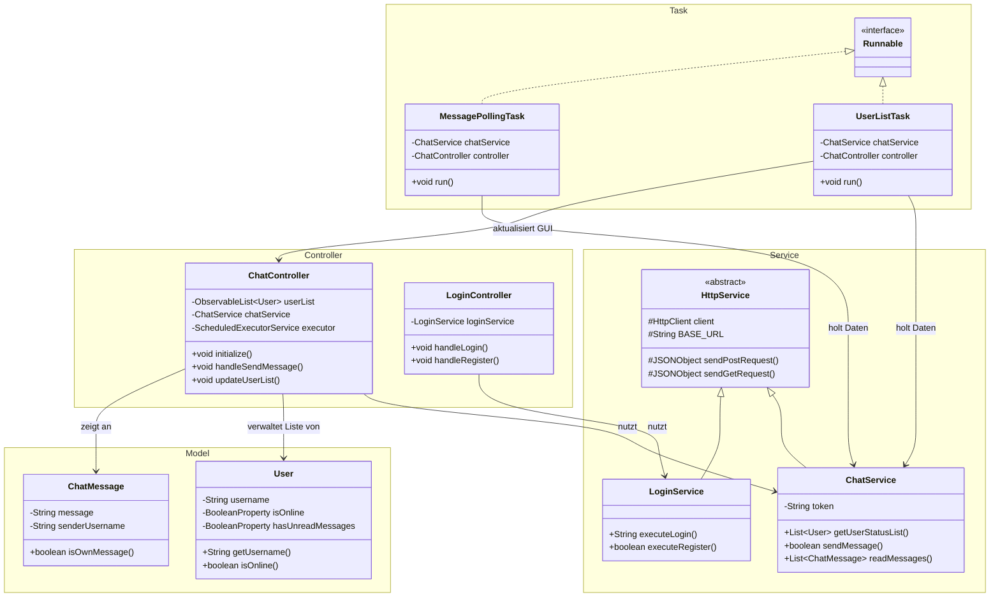
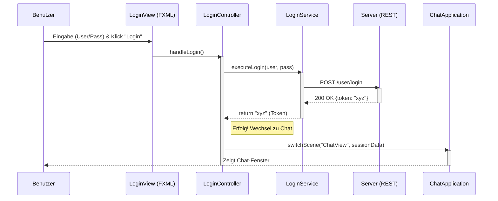
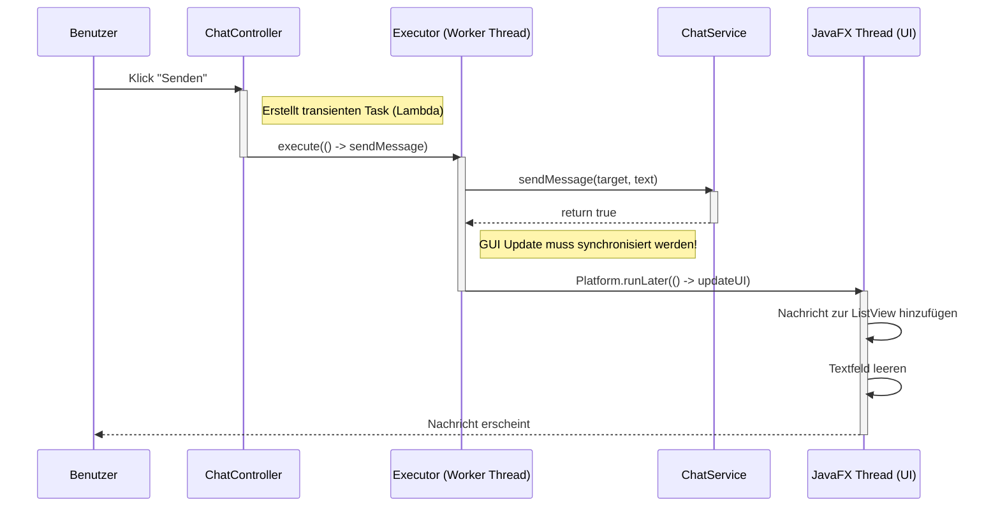
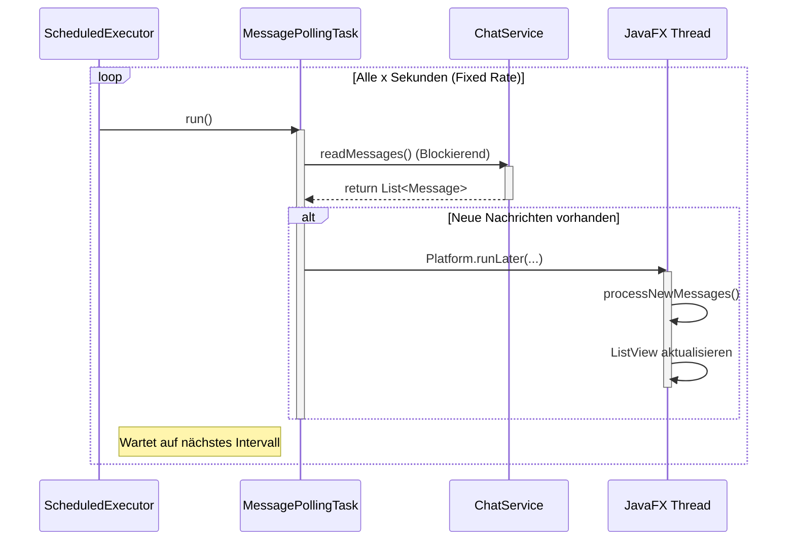

# **Projektdokumentation: FXChatClient**

## **1\. Projektübersicht**

Der **FXChatClient** ist ein JavaFX-basierter Chat-Client, der mit einem REST-basierten Backend kommuniziert. Das Ziel des Projekts war die Entwicklung einer reaktionsfähigen Desktop-Anwendung unter Berücksichtigung moderner Architektur-Patterns (MVC) und Multithreading-Strategien.

### **1.1 Zusatz: Kotlin Client vs. JavaFX**

Zu Beginn des Projekts stellte sich die GUI-Programmierung mit JavaFX, insbesondere die Synchronisation von Threads und UI-Updates, als unerwartet komplex und teilweise veraltet ("nicht mehr zeitgemäss") heraus.  
Da die Entwicklung gegen die Server-API an sich jedoch reibungslos funktionierte und Spass machte, wurde parallel ein Kotlin Client entwickelt. Dieser diente als Referenzimplementierung, um die API-Kommunikation losgelöst von den JavaFX-Tücken zu testen. Diese Dokumentation fokussiert sich jedoch auf den FXChatClient und die Lösung der dortigen Concurrency-Herausforderungen.

Das Repo ist unter `https://github.com/UrbanDaveBE/KotlinChatClient` verfügbar.

### **1.2 Technische Voraussetzungen**

* **Sprache:** Java (JDK 21)
* **GUI-Framework:** JavaFX
* **Kommunikation:** HTTP / REST (via java.net.http.HttpClient)
* **Datenformat:** JSON (org.json)

## **2\. Architektur & Design Patterns**

Die Anwendung folgt einer klaren Trennung der Zuständigkeiten (Single Responsibility Principle), um Wartbarkeit und Erweiterbarkeit zu gewährleisten.

### **2.1 Model-View-Controller (MVC)**

* **Model:** Datenklassen wie `User` und `ChatMessage` sowie die `ObservableList`. Sie halten keine Geschäftslogik, sondern repräsentieren nur den Zustand der Anwendung.
* **View:** Definiert in `.fxml`-Dateien. Sie kümmern sich ausschliesslich um das Layout und das Design der Komponenten (SplitPane, ListView), enthalten aber keinen Java-Code.
* **Controller:** (`ChatController`, `LoginController`) Verbindet View und Model. Er reagiert auf Benutzeraktionen und aktualisiert die GUI (vgl. MVC-Konzept aus der Vorlesung).

### **2.2 Service Layer (Geschäftslogik)**

Damit die Controller schlank bleiben, wurde die Netzwerklogik in eine eigene Service-Schicht ausgelagert. Diese Schicht ist nicht Teil des MVC-Patterns, sondern erweitert es.

* **HttpService (Abstrakt):** Dient als Basisklasse und implementiert die Low-Level-HTTP-Methoden (sendGetRequest, sendPostRequest). Hier wird der HttpClient zentral verwaltet.
* **LoginService:** Erbt von HttpService. Kapselt die Authentifizierungslogik (Ping, Register, Login) und gibt bei Erfolg das Session-Token zurück.
* **ChatService:** Erbt von HttpService. Verwaltet die eigentliche Chat-Funktionalität (Polling von Nachrichten, Senden, User-Liste abrufen). Er wird erst nach erfolgreichem Login instanziiert und hält das Session-Token.

### **2.3 Eingesetzte Patterns**

| Pattern | Anwendung im Projekt       | Vorteil |
| :---- |:---------------------------| :---- |
| **Singleton** | `HttpClient` im `LoginService` | Ressourceneffizienz, da der Client nicht für jede Anfrage neu erstellt wird. |
| **DRY (Don't Repeat Yourself)** | `HttpService` Basisklasse    | Gemeinsame Logik für GET/POST-Requests wurde zentralisiert, sodass `LoginService` und `ChatService` davon erben können. |
| **Observer** | `ObservableList`             | Automatische Synchronisation zwischen Datenliste und GUI (`ListView`). |

### **2.4 Klassendiagramm**


### **2.4 Sequenzdiagram: Login**


### **2.5 Sequenzdiagram: Nachricht senden**

### **2.6 Sequenzdiagram: Nachricht empfangen**




## **3\. GUI-Aufbau (Chat-Fenster)**

Die grafische Oberfläche ist primär durch eine SplitPane geteilt:

* **Linker Bereich (User-Liste):**
    * Eine `ListView`, die alle verfügbaren Benutzer anzeigt.
    * Verwendet eine `CellFactory`, um den Online-Status visuell darzustellen.
* **Rechter Bereich (Chat):**
    * Eine Liste (`ListView`), welche den Nachrichtenverlauf darstellt.
    * Eingabefeld und Senden-Button im unteren Bereich.


## **4\. Concurrency & Multithreading**

Ein zentraler Aspekt der Anwendung ist die Handhabung von Netzwerkoperationen. Da HTTP-Anfragen (wie Login oder Polling) Zeit beanspruchen, dürfen sie keinesfalls im **JavaFX Application Thread** ausgeführt werden, da dies die GUI einfrieren lassen würde.

### **4.1 Ausgangslage: Das Blockierungsproblem**

Ein direkter Aufruf von `chatService.getUserStatusList()` im Hauptthread führt dazu, dass die Anwendung für die Dauer der Anfrage (z.B. bis zum Timeout) nicht mehr reagiert. Dies verletzt die Grundregel, dass langlaufende Tasks ausgelagert werden müssen (vgl. Folie 13, "Unresponsive UI").

### **4.2 Lösungsstrategien**

Im Verlauf des Projekts wurden zwei Strategien evaluiert und implementiert, die sich an den Inhalten des Moduls (Skript 06\_Concurrency.pdf) orientieren:

#### **Strategie A: Manuelle Threads (Low-Level)**

Hierbei wird ein `Runnable` erstellt, das in einer `while`-Schleife läuft und mittels `Thread.sleep(nn)` pausiert.

* **Vorteil:** Einfach zu verstehen für den Einstieg.
* **Nachteil:** Fehleranfällig beim Beenden. Der Thread muss manuell mittels `interrupt` gestoppt werden, um ihn aus dem Schlaf zu wecken. Zudem muss das Polling-Flag als volatile markiert sein, damit Änderungen sofort sichtbar sind.
* **Wichtig:** Änderungen an der GUI müssen zwingend in `Platform.runLater()` gekapselt werden, um Thread-Konflikte zu vermeiden.

#### **Strategie B: ExecutorService (High-Level / Aktuelle Implementierung)**

Die modernere und sauberere Lösung nutzt den `ScheduledExecutorService`.

* **Implementierung:** Ein Thread-Pool verwaltet die Ausführung.
* **Polling:** Anstatt einer manuellen `while`-Schleife im Task wird `scheduleAtFixedRate` verwendet. Der Executor kümmert sich um das Timing.
* **Senden:** Einmalige Aufgaben (wie das Senden einer Nachricht) werden als transienter Task `execute()` an den Executor übergeben.

```java
executorService.execute(() -> {
            boolean success = chatService.sendMessage(targetUser, message);

            Platform.runLater(() -> {
                if(success){
                    ChatMessage sentMsg = new ChatMessage(message,username);
                    processSentMessage(sentMsg, targetUser);
                    System.out.println("[handleSendMessage]: Nachricht an ["+targetUser.getUsername()+"] gesendet: " + message);
                    messageInput.clear();
                    messageInput.requestFocus();
                } else{
                    DialogUtil.showAlert(Alert.AlertType.ERROR, "Fehler", "Nachricht konnte nicht gesendet werden.");
                }
            });
        });
```

**Warum ScheduledExecutorService?**  
Im Gegensatz zu einem **FixedThreadPool** (der für dauerhafte Blockierung durch `Thread.sleep` ungeeignet wäre, da er Threads unnötig belegt), ist der `ScheduledExecutorService` speziell für **wiederkehrende Aufgaben** optimiert. Er blockiert keine Threads während der Wartezeit.

## **5\. Kommunikation & API**

Die Kommunikation mit dem Server erfolgt über REST-Calls. Zur Verifizierung der Server-Endpunkte können folgende cURL-Befehle verwendet werden:

### **5.1 Authentifizierung**

**Login:**
```bash
curl -X POST http://javaprojects.ch:50001/user/login -d '{"username":"UserName","password":"PassWord"}'
```
*Antwort:* Liefert ein Token zurück, das für alle weiteren Anfragen benötigt wird.

### **5.2 Chat-Funktionen**

**Nachricht senden:**
```bash 
curl -X POST http://javaprojects.ch:50001/chat/send) -d '{"username": "zieluser", "token": "...", "message": "hello world!"}'
```
*Antwort:* Liefert `true` oder `false` zurück.

**Polling (Nachrichten abrufen):**
```bash 
curl -X POST http://javaprojects.ch:50001/chat/poll -d '{"token": "\[TOKEN\]"}'
```
*Antwort:* Liefert `messages` mit einer Liste von `message` bzw. `username`zurück.